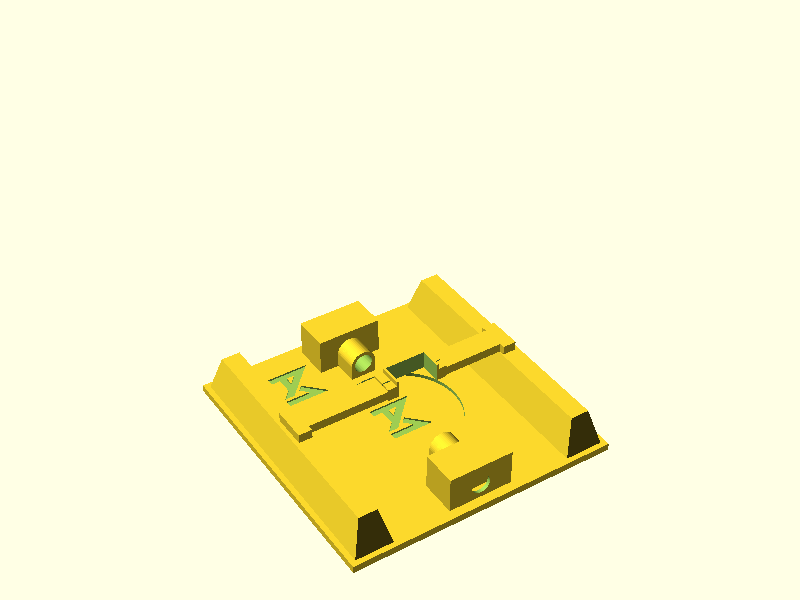

# Cargo Holder

Mechanism to securely attach / detach a cargo container to / from the drone.

Overview of the assembled mechanism:



Directory tree:

```
.
├── 3d-models
│   ├── openscad files
│   └── stl files
├── images
└── scripts
```

## Export stl-files

To create the stl-files, execute the following command and make sure that you
can export from OpenSCAD using the command line.

```
cd scripts
./export_stl_files.sh
```

**Make sure that you are in the `scripts` directory when executing the script**
**or else it may create a new folder.**

## Create Preview Images

To create preview images, execute the following command and make sure that you
can export from OpenSCAD using the command line.

```
cd scripts
./create_preview_images.sh
```

A separate script exists to create the animated gif of the assembled model:

```
cd scripts
./create_assembled_preview.sh
```

**Make sure that you are in the `scripts` directory when executing the scripts**
**or else it may create a new folder.**
