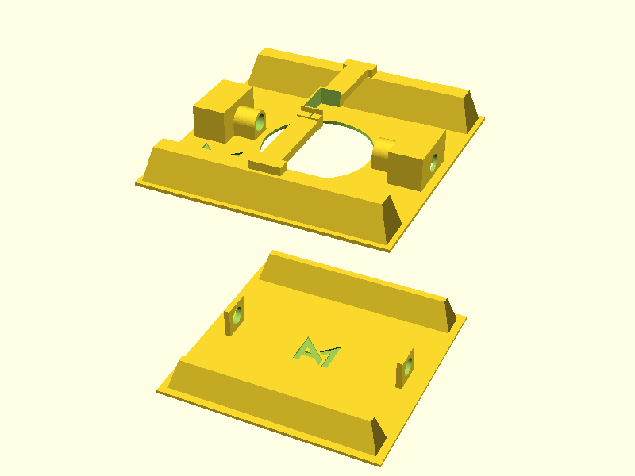

# 03 - Cargo Holder

**Status:** work in progress

**Main Goal:** Create a mechanism that can securely attach a cargo container to
the drone and safely release it.

After compelting this milestone, the drone should have a cargo area and a
mechanism to securely attach a cargo container to it. It is ok if the drone and
the cargo container have to be "precisely" positioned (+- 5mm in each direction).

## Requirements

- Lightweight mechanism
- Reliable mechanism
    - Don't wear off (fast) / Don't break
    - Allow for slightly misaligned cargo container

## Prototype Versions

In this directory you can find images and 3d-files of the various prototypes
with information on advantages and disadvantages. The latest and currently used
version can be found in `/Cargo Holder/`.

### Version 1

The design of the first version started before it was clear which drone will be
used in this project. The dimensions are therefore not perfectly suited for the
DJI Phantom 4 Pro V2.

[Demo Video (YouTube)](https://youtu.be/va2LqXQMh1Y)

### Version 2

This version of the Cargo Holder is adapted for the DJI Phantom 4 Pro V2. The
cargo container will be mounted on the back side of the landing gear.

**This version is still work in progress.**
