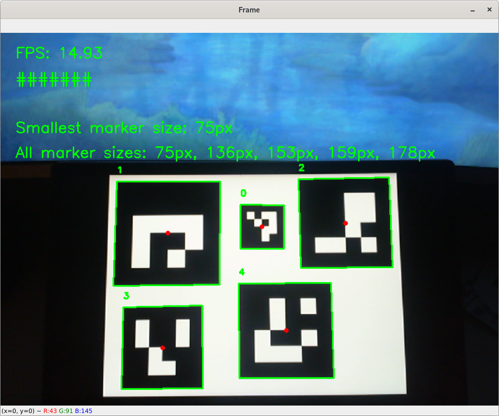

# 06 - Precision Landing

**Status:** work in progress

**Main Goal:** Precisely land the drone on a marker.

After completing this milestone, the drone should be able to precisely land on
a marker. This marker is later to be placed on the cargo station for further
development for the cargo pick-up and drop-off routines.

**To achive the main goal, the following tasks have to be finished:**

1. Create ArUco markers
2. Detect ArUco markers
3. Camera Calibration
4. Get relative position of ArUco marker / camera
5. Landing

## 1. Create ArUco markers

The first step is to create ArUco markers, so that they can be printed out and
detected by the drone.

For this step, I slightly modified the script of
[this tutorial](https://pyimagesearch.com/2020/12/14/generating-aruco-markers-with-opencv-and-python/)
from [pyimagesearch.com](https://pyimagesearch.com).

The following will create ArUco markers of type `4X4_50` and save them to
`./development/images/ArUco markers/4X4_50/`:

```
cd "development/scripts/01 - Create ArUco markers"
python3 create_aruco_markers.py
```

**Make sure that your current directory is `./development/scrips/` when**
**executing the script or else it will create a new output folder for the**
**images.**

Here is a collection of some markers that are created using the script:


## 2. Detect ArUco markers

To detect ArUco markers, I am using OpenCV, since it is already supported.

### Basic Detection

I slightly modified the script of
[this tutorial](https://pyimagesearch.com/2020/12/21/detecting-aruco-markers-with-opencv-and-python/)
from [pyimagesearch.com](https://pyimagesearch.com). This script was only used
for the first tests and to learn something about OpenCV and how the ArUco marker
detection works.

```
cd "development/scripts/02 - Detect ArUco markers"
python3 detect_aruco_markers_basic.py
```


### Adaptive Resolution

The higher the image resolution, the lower the FPS, because computational effort
increases. Why not reduce the resolution then? If the resolution is too low, a
marker may not be detected; especially if it is far away from the camera.

Adaptively reducing the image resolution seems like the way to go. For this
reason I created this script, a modified version of the previous one.

```
cd "development/scripts/02 - Detect ArUco markers"
python3 detect_aruco_markers_adaptive_resolution.py
```

This script now also displays the FPS and the size of the smallest side of each
marker currently detected.



## 3. Camera Calibration

Execute the following command to get the camera calibration values.

```
cd "development/scripts/03 - Calibrate camera"
python3 camera_calibration.py
```

Press "c" to quit taking snapshots and start calculating. The script will then
save the results in a json-file.
